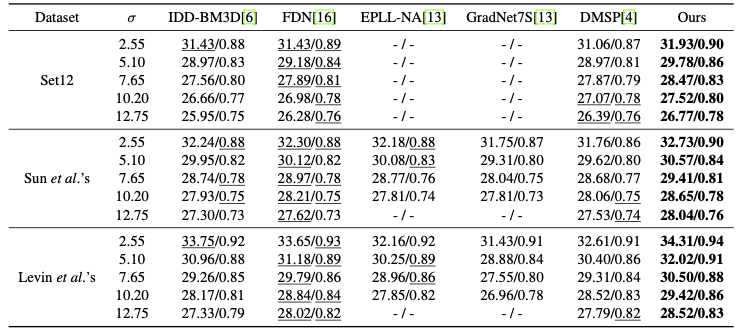

#Variational-EM-based Deep Learning for Noise-blind Image Deblurring

This repo provides pre-trained models and the results on benchmark datasets of our CVPR 2020 paper.
[main paper](./paper/vem_deconv.pdf), [supp](./paper/supp.pdf),


## Usage
Download [pretrained models](https://drive.google.com/open?id=1Pk39Sdhn8mhodZUHz7_Ml4HTDmRL_qDV). Put them into separate folders. The blurry inputs and kernels for Set12 can be found in this [link](https://drive.google.com/drive/folders/1n5VKsE2VfwckgV_lPPpgNoCb_zTtye4T?usp=sharing). 

Run `test.py` for deblurred images. 

You can also test your data. 


## Results

* Comparison with noise-blind deconvolution



* Comparison with fixed-noise deconvolution

  

## Results on benchmark datasets

You can also download the [deblurred results](https://drive.google.com/open?id=1Rfn8S72fUq7KPq40ruWrIcTaD9RbOzrR) and run `compute_metrics.py` to compute the PSNR/SSIM with the same settings as ours. We also provide the results from FCNN as benchmark. Please also refer to their results. 

## Key References

**IDD-BM3D:**  Danielyan, Aram, Vladimir Katkovnik, and Karen Egiazarian. "[BM3D frames and variational image deblurring.](https://arxiv.org/pdf/1106.6180.pdf)" *IEEE Transactions on Image Processing* 21.4 (2011): 1715-1728.

**FDN:** Kruse, Jakob, Carsten Rother, and Uwe Schmidt. " [Learning to push the limits of efficient FFT-based image deconvolution. ](http://research.uweschmidt.org/pubs/iccv17kruse.pdf)" *Proceedings of the IEEE International Conference on Computer Vision*. 2017.

**EPLL-NA/GradNet7S:** Jin, Meiguang, Stefan Roth, and Paolo Favaro. "[Noise-blind image deblurring.](http://openaccess.thecvf.com/content_cvpr_2017/papers/Jin_Noise-Blind_Image_Deblurring_CVPR_2017_paper.pdf)" *Proceedings of the IEEE Conference on Computer Vision and Pattern Recognition*. 2017.

**DMSP:** Bigdeli, Siavash Arjomand, et al. "[Deep mean-shift priors for image restoration.](https://arxiv.org/pdf/1709.03749.pdf)" *Advances in Neural Information Processing Systems*. 2017.

**EPLL:** Zoran, Daniel, and Yair Weiss. "[From learning models of natural image patches to whole image restoration.](https://people.csail.mit.edu/danielzoran/EPLLICCVCameraReady.pdf)" *2011 International Conference on Computer Vision*. IEEE, 2011.

**CSF:** Schmidt, Uwe, and Stefan Roth. "[Shrinkage fields for effective image restoration.](http://research.uweschmidt.org/pubs/cvpr14schmidt.pdf)" *Proceedings of the IEEE Conference on Computer Vision and Pattern Recognition*. 2014.

**FCNN:** Zhang, Jiawei, et al. "[Learning fully convolutional networks for iterative non-blind deconvolution](https://arxiv.org/pdf/1611.06495.pdf)." *Proceedings of the IEEE Conference on Computer Vision and Pattern Recognition*. 2017.

**IRCNN:** Zhang, Kai, et al. "[Learning deep CNN denoiser prior for image restoration](http://openaccess.thecvf.com/content_cvpr_2017/papers/Zhang_Learning_Deep_CNN_CVPR_2017_paper.pdf)." *Proceedings of the IEEE conference on computer vision and pattern recognition*. 2017.


## Bibtex
```
@InProceedings{Nan_2020_CVPR,
author = {Nan, Yuesong and Quan, Yuhui and Ji, Hui},
title = {Variational-EM-Based Deep Learning for Noise-Blind Image Deblurring},
booktitle = {Proceedings of the IEEE/CVF Conference on Computer Vision and Pattern Recognition (CVPR)},
month = {June},
year = {2020}
}
```